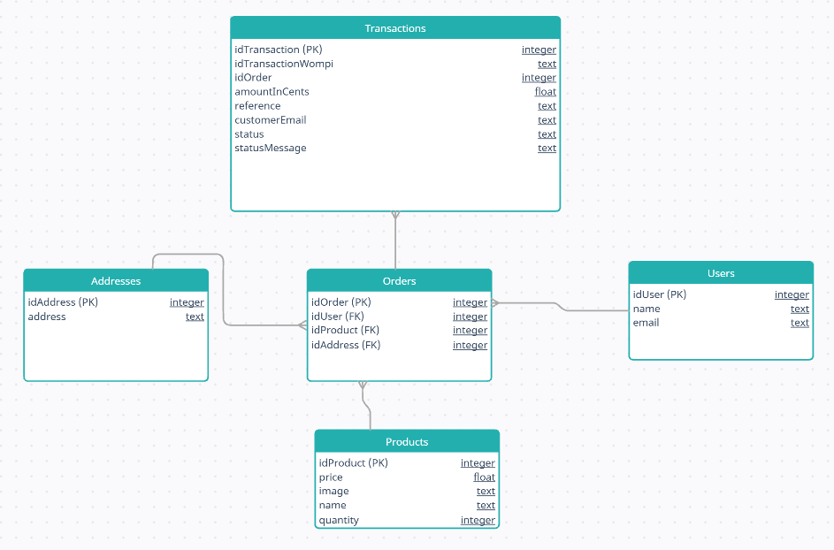

# The Shop - React + NestJS

## Descripción

Este proyecto es una **aplicación fullstack** para una tienda de productos que permite a los clientes realizar compras mediante pagos con tarjeta de crédito.

- **Frontend:** React (SPA con Vite)
- **Backend:** Node.js con NestJS
- **Base de datos:** PostgreSQL
- **Pagos:** Integración con pasarela de pago para tarjetas de crédito

El objetivo principal es ofrecer una experiencia de compra sencilla y segura para los usuarios, con un backend robusto y pruebas unitarias para garantizar la calidad del código.

---

## Características

- Listado de productos
- Formulario de continuación del proceso por si algo falla
- Formulario de compra
- Resumen de la compra
- Creación de usuarios, direcciónes, órdenes y transacciones

---

## Tecnologías

- **Frontend:** React, Vite, TailwindCSS (opcional)
- **Backend:** NestJS, TypeScript
- **Base de datos:** PostgreSQL
- **Pruebas:** Jest (frontend y backend)
- **Herramientas de desarrollo:** ESLint, Prettier, Postman

---

## Modelo de Datos

El siguiente diagrama muestra las entidades de la base de datos y sus relaciones:

---

## Pruebas Unitarias

El proyecto cuenta con pruebas unitarias para backend y frontend.

### Coverage Frontend

| Tipo       | Cobertura |
| ---------- | --------- |
| Statements | 86.87%    |
| Branches   | 72.34%    |
| Functions  | 77.46%    |
| Lines      | 87.3%     |

### Coverage Backend

| Tipo       | Cobertura |
| ---------- | --------- |
| Statements | 100%      |
| Branches   | 80.95%    |
| Functions  | 100%      |
| Lines      | 100%      |

## Colección de postman

📬 [Descargar colección de Postman](docs/postman_collection.json)
